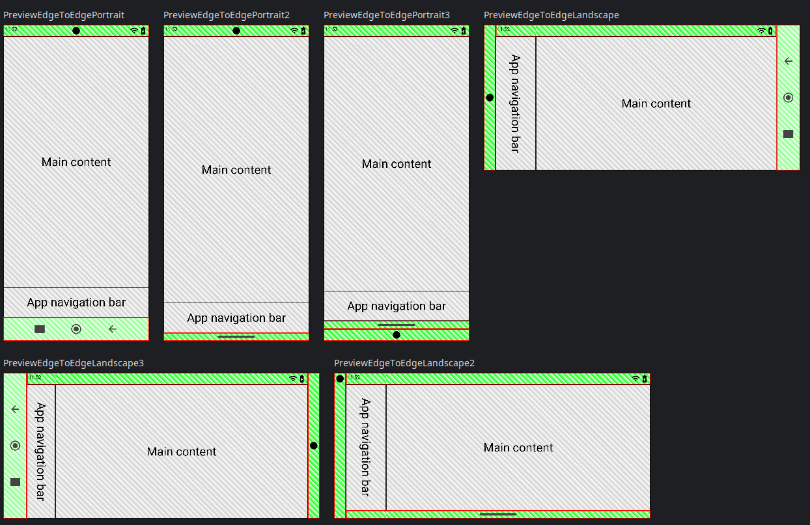

# Jetpack Compose previews and testing for edge-to-edge design

Library which enables you to show WindowInsets in Jetpack Compose previews.

Supported insets are the status bar, navigation bar and a camera display cutout. It also is able to show many different configurations of the system bars.

# [Preview simulation library](edge_to_edge_preview_lib/README.md)

Library that you can use to simulate window insets like the status bar or navigation bar and much more.

Use cases:
- Android Studio preview.
- Screenshots
- Testing with robolectric

# [Overlap testing library](edge_to_edge_test_lib/README.md)

Library which enables you to test for overlapping components.

- Device/Emulator tests
- Robolectric tests

# [Recording insets from devices](device_recording/README.md)

# Why is it good to have previews for WindowInsets?
I wrote an article about this here:
https://medium.com/@timo_86166/jetpack-compose-previews-for-edge-to-edge-design-a03b3a3713f3
