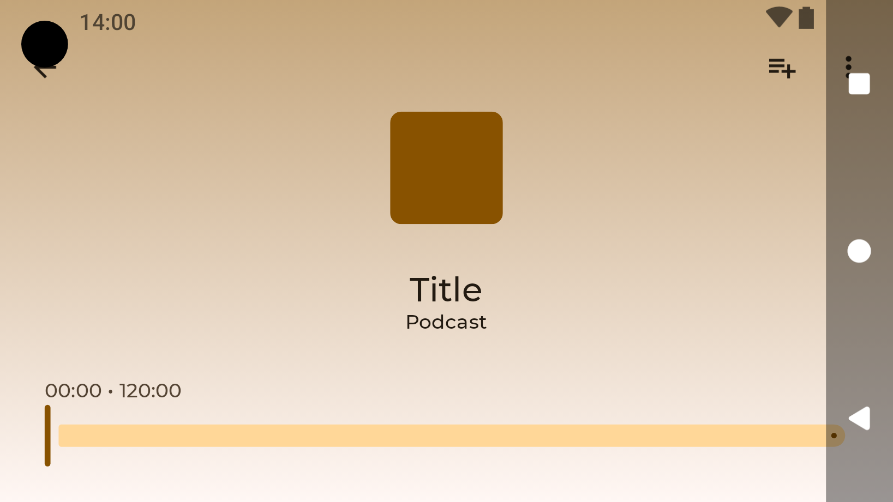
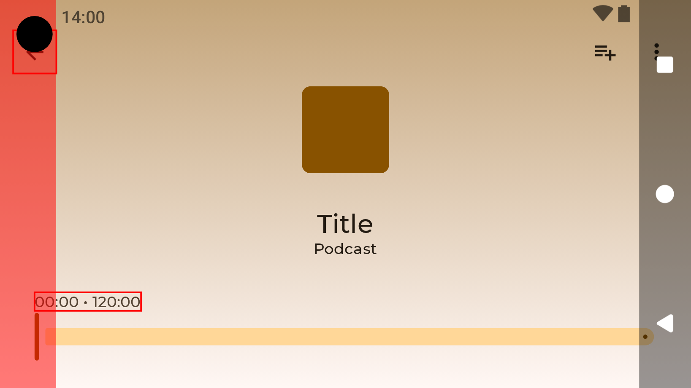
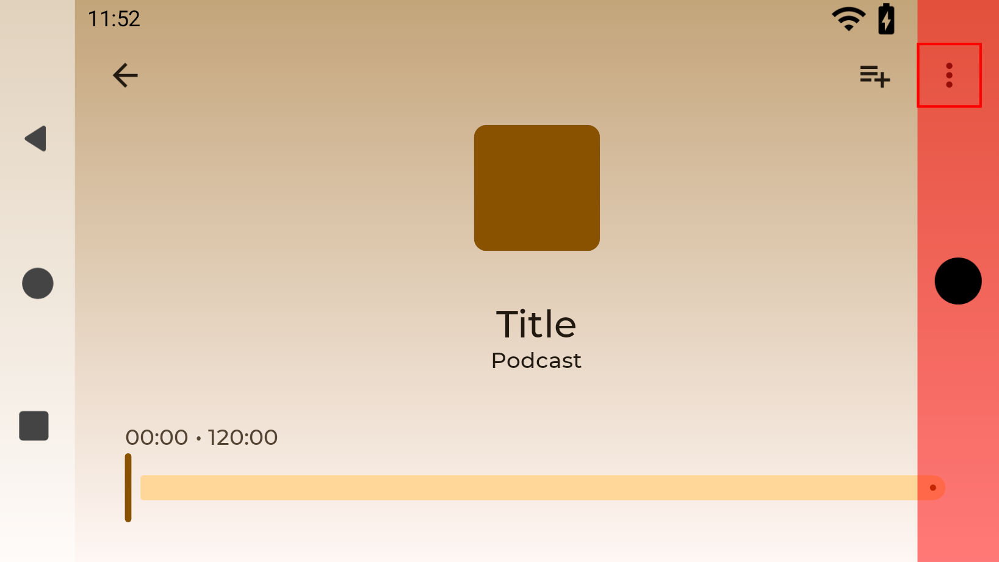

Add dependency:

[](https://mvnrepository.com/artifact/de.drick.compose/edge-to-edge-preview-check)

```kotlin
dependencies {
    implementation("de.drick.compose:edge-to-edge-preview-check:<version>")
}
```

Quickstart:

Since "Android Studio Ladybug" previews of edge-to-edge design is possible. 
```kotlin
@Preview(name = "Edge-to-edge",
    device = "spec:...,cutout=punch_hole,navigation=buttons",
    showSystemUi = true
)
```


To make the problems a little bit more obvious you can add this `TestWindowInsets` to your preview.

```kotlin
@DevicePreviews
@Composable
fun PlayerScreenPreview() {
    TestWindowInsets {
        onAllNodes(SemanticsMatcher
            .keyIsDefined(SemanticsProperties.Text)
            .or(hasClickAction())
        ).checkOverlap(WindowInsets.safeDrawing)
        onAllNodes(hasClickAction())
            .checkOverlap(WindowInsets.tappableElement)
    }
    JetcasterTheme {
        PlayerScreen(
            //...
        )
    }
}
```



Unfortunately there is a not detected problem with the navigation bar. But it turned out that this is a bug in Android Studio. It does not provide insets information correctly for the system navigation bar when in landscape mode.

Just use the EdgeToEdgeTemplate composable around your content to get a correct inset preview. You also have a lot more configuration options.


```kotlin
@DevicePreviews
@Composable
fun PlayerScreenPreview() {
    EdgeToEdgeTemplate(
        isInvertedOrientation = true,
        navMode = NavigationMode.ThreeButton
    ) {
        TestWindowInsets {
            //...
        }
        JetcasterTheme {
            PlayerScreen(
                //...
            )
        }
    }
}
```



So it is implemented correctly inside of the app. It just not handle the WindowInsets.displayCutout. 