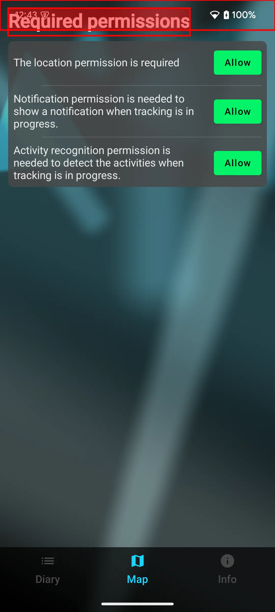

# Testing window insets

Add this dependency:

[](https://mvnrepository.com/artifact/de.drick.compose/edge-to-edge-test)

```kotlin
dependencies {
    //...
    androidTestImplementation("de.drick.compose:edge-to-edge-test:<version>")
}
```

## Integration tests (androidTest)

If you do not have setup any compose ui tests yet just follow the official Android tutorial here: https://developer.android.com/develop/ui/compose/testing

If you are using the `createComposeRule()` approach please note that an Activity is used behind the scene that does not enable edge-to-edge. So you need to set target api to 35 and use an android 15 device to see any window insets or you could enable it manually in your test by following code:

```kotlin
@Composable
fun enableEdgeToEdge(): ComponentActivity? {
    val ctx = LocalContext.current
    return remember {
        (ctx as? ComponentActivity)?.apply { 
            enableEdgeToEdge()
        }
    }
}
```

Make sure to put the `SemanticsWindowInsetsAnchor()` composable in your content. It is used to detect the window insets.

```kotlin
class EdgeToEdgeTestEmpty {
    @get:Rule
    val composeTestRule = createComposeRule()

    @Before
    fun testWindowInsets() {
        composeTestRule.setContent {
            
            enableEdgeToEdge()             // calls enableEdgeToEdge on the activity
            
            SemanticsWindowInsetsAnchor()  // Needed for the test function to detect the WindowInsets
            
            YourAppTheme {
                ComposeScreenToTest()
            }
        }
    }
}
```

After everything is prepared we can test for ui components which are overlapping with the window insets:

```kotlin
//...
    @Test
    fun testWindowInsets() {
        composeTestRule.waitForIdle()
        composeTestRule
            .onAllNodes(SemanticsMatcher.keyIsDefined(SemanticsProperties.Text))
            .assertWindowInsets(
                insetType = WindowInsetsCompat.Type.systemBars() or
                      WindowInsetsCompat.Type.displayCutout()
            )
        
    }
```

When there is something overlapping we get an explanation in the test report which inset is overlapping with which component.

```plaintext[]
java.lang.AssertionError:
Semantics of the node:
Node #16 at (l=32.0, t=32.0, r=746.0, b=140.0)px
Text = '[Required permissions]'
Actions = [SetTextSubstitution, ShowTextSubstitution, 
           ClearTextSubstitution, GetTextLayoutResult]
Has 5 siblings
Selector used: (Text is defined)

[statusBars, displayCutout] overlap with node!
scroll position: 0.0
Device: Pixel 7a - 15
Screenshot: [Pixel 7a - 15] screenshot_node_16.png
```

If you provide a file name in the `screenshotBaseName` parameter of the assertWindowInsets function it will also create a screenshot with overlap markings. But it is not included in the test report. It is just collected in the `app/build/outputs/connected_android_test_additional_output` folder.



## Robolectric

There many reasons why it makes sense to write tests using Robolectric. Especially for edge-to-edge design. If we want to check every possible configuration of window insets we would need a lot of different devices with different configurations. Or different emulators. But for our test system this would require a lot of resources. So with robolectric we can simulate window inset configurations from as many different devices like we want.

```kotlin
dependencies {
    //...
    implementation("de.drick.compose:edge-to-edge-preview:<version>")
    testImplementation("de.drick.compose:edge-to-edge-test:<version>")
}
```

Please see the official Robolectric documentation for detailed instructions how to setup tests. 

In my tests i am using target api 35. So for robolectric i have to define sdk 34 explicitly because 35 is not supported.

```kotlin
@Config(sdk = [34])
class WindowInsetsRobolectricTests() {
    @get:Rule
    val composeTestRule = createComposeRule()

    @Test
    @GraphicsMode(GraphicsMode.Mode.LEGACY)
    fun windowInsetsTest() {
        composeTestRule.setContent {
            EdgeToEdgeTemplate(
                navMode = NavigationMode.ThreeButton,
                isInvertedOrientation = true
            ) {
                SemanticsWindowInsetsAnchor()
                CompositionLocalProvider(LocalInspectionMode provides true) {
                    AppTheme {
                        MainScreen()
                    }
                }
            }
        }
        composeTestRule.waitForIdle()

        // Test text
        composeTestRule
            .onAllNodes(SemanticsMatcher.keyIsDefined(SemanticsProperties.Text))
            .assertWindowInsets(insetType = WindowInsetsCompat.Type.systemBars() or WindowInsetsCompat.Type.displayCutout())

        // Test buttons
        composeTestRule
            .onAllNodes(hasClickAction())
            .assertWindowInsets(insetType = WindowInsetsCompat.Type.tappableElement())
    }
}
```


## Planned features

### Dynamic testing of window insets
Because it is important that an app do work with all kind of configurations of devices. It would be nice to be able to test all different window inset types independently and see if any of them overlap with content.
This means that we have to change the window insets during the test. So we can check if the UI adapts correctly to all different types of window insets.
